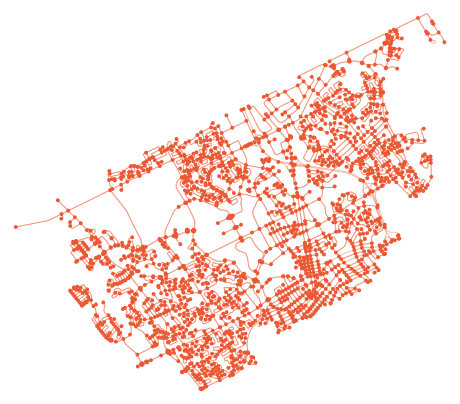

### Hey, I'm Adriana
Welcome to my tech toolbox ⚙️! I hope you came here with public transit.... a street map of where I live and study (made using [OSMnx](https://linkinghub.elsevier.com/retrieve/pii/S0198971516303970)):

</img>

I mostly code to get creative; I'm currently learning frontend frameworks and native app dev (React, Gatsby, React Native), playing around with visualization tools and trying out Javascript libraries. I've equally had the chance to try out developement/UX/product roles as an Innovation Developer intern at RBC in the summer of 2021. 

I have a sweet spot for the future of cities, especially transportation (urban tech in general). If you're interested in chatting about that kind of stuff, shoot me a message through my [LinkedIn](https://www.linkedin.com/in/adriana-ceric/)/[email](adriana.ceric@gmail.com), or get to know me more through my [website](https://adrianaceric.github.io/).

Some of my favourite projects:
